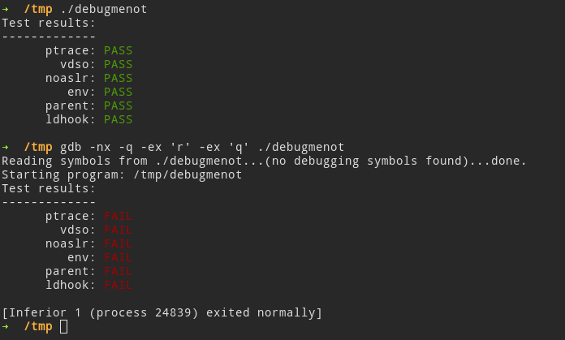

# debugmenot
Debugmenot is a collection of simple anti-debugging tricks targeting gdb / lldb on Linux. Or, in a more picturesque description:

The checks performed by debugmenot include well-known sanity-checks on the environment (parent process, environment variables, `ptrace`, ...), as well as less-known techniques that detect breakpoints automatically set by debuggers which most people are not aware of.

Feel free to implement new checks, pull requests are always welcome.

Functionality was tested on x86, x86-64, ARMv7 and ARMv8.
